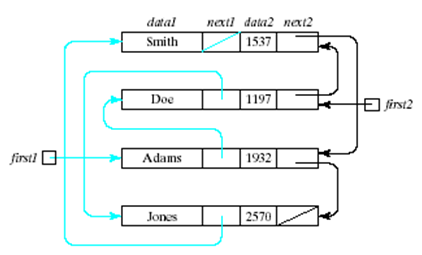

##Microproject #1 - insert function into multiply-ordered list

**Multiply-ordered list** is a list which is ordered according to multiple keys.

>Ilustration from the book _Nyhoff, ADTs, Data Structures and Problem Solving with C++, Second Edition, © 2005 Pearson Education, Inc. All rights reserved. 0-13-140909-3_

>
>

Code::Blocks project